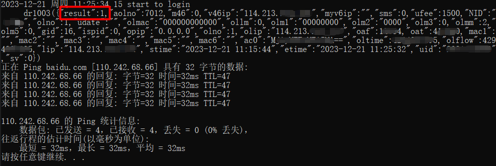
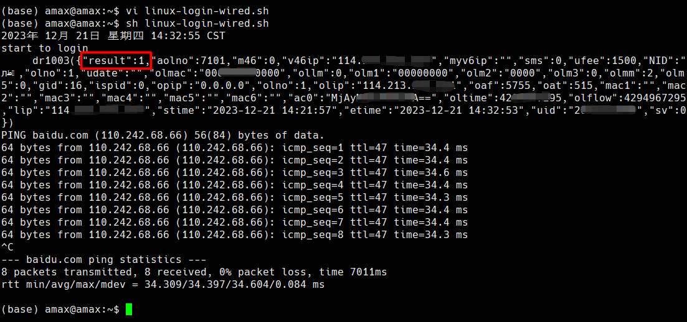

## 合肥工业大学校园网自动登录脚本 2023 版 :globe_with_meridians:

由于你工在 2023 年 10 月 [更新了校园网的登录页面和接口](https://it.hfut.edu.cn/info/1026/2698.htm)，
为了提高办公效率，在此制作了两个脚本，用于在 Windows 和 Linux 系统中自动登录校园网账户，首次使用的步骤分别如下：

### Windows
1. 下载仓库到本地， git clone 或者直接下载仓库压缩包均可以
2. 记事本编辑 `win-login-wired.bat`，将 `set id="xxx"` 和 `set passwd="xxx"` 中的 xxx 分别改为自己的学号和校园网密码，保存
3. 直接双击该文件运行，如果终端能看到 `"result": 1` 或者 `ping baidu` 成功，说明登录成功；如果看到 `"result": 0`，可能是用户名和密码不匹配



### Linux

1. 下载仓库到本地，请直接下载仓库压缩包，不要用 git clone
2. `vi linux-login-wired.sh`：将 `id="xxx"` 和 `passwd="xxx"` 中的 xxx 分别改为自己的学号和校园网密码，保存。
3. 确保系统安装了 curl 库，如果没有的话需要安装：
```bash
# ubuntu
sudo apt install curl

# centos
sudo yum install curl
```
4. `sh linux-login-wired.sh`：运行，如果终端能看到 `"result": 1` 或者 `ping baidu` 成功，说明登录成功；如果看到 `"result": 0`，可能是用户名和密码不匹配



### 注意事项 :warning:
- 使用 Linux 登录脚本时，请直接下载仓库的压缩包解压后传到 Linux 上，<font color="orange">不要先 git clone 到 windows 主机的本地，再用远程文件传到Linux主机上用，这样的话 shell脚本的换行符会变成CRLF，导致无法正常运行</font>
- 使用前请确保你的校园网口没有故障，且所在网段允许访问外网
- 本项目只支持有线网登录，暂时不支持无线网（HFUT-WiFi）
- 本项目遵循 [GPL2.0 协议](https://choosealicense.com/licenses/gpl-2.0/)，根据该协议，本项目的作者无需对您使用这个脚本带来的任何后果负责
